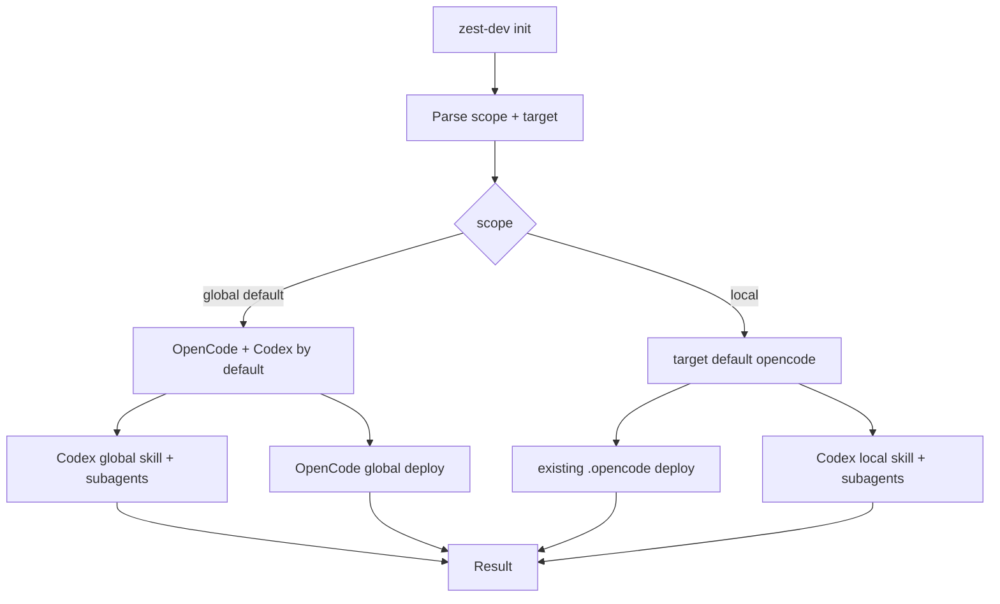

## Overview

### Problem Statement

`zest-dev init` 当前在当前目录初始化 OpenCode command/skill 文件和 Codex skill/subagent 文件。期望调整为默认在全局位置创建 OpenCode 与 Codex 文件；Claude Code 通过 plugin 机制处理，退出本次 CLI init 范围。

### Goals

- 默认行为等价于 `zest-dev init --global`。
- `--target` 默认值随 scope 变化：global scope 默认 `all`，local scope 默认 `opencode`。
- 支持为 OpenCode 创建全局 command 和 skill 文件。
- 支持为 Codex 创建全局 skill 和 subagent 文件。
- 保留原来的当前目录初始化能力，通过 `--local` 参数显式启用。
- 让用户能够清楚地区分全局初始化和本地初始化。

### Scope

- 更新 `zest-dev init` 的默认目标位置。
- 增加或完善 `--global` 与 `--local` 参数行为。
- 覆盖相关 CLI 帮助文案、部署路径逻辑和测试。

### Success Criteria

- 执行 `zest-dev init` 时会创建 OpenCode 全局 command/skill 文件和 Codex 全局 skill/subagent 文件。
- 执行 `zest-dev init --global` 与默认行为一致。
- 执行 `zest-dev init --local` 时保留原来的当前目录初始化行为。
- 未传 `--target` 时，`zest-dev init` 与 `zest-dev init --global` 使用 `--target all`；`zest-dev init --local` 使用 `--target opencode`。
- OpenCode 和 Codex 的目标文件均按对应平台规则生成。
- Claude Code 相关安装由 plugin 机制承接。

## Research

### Existing System

- `zest-dev init` 目前只有 `--target <target>` 参数，默认值是 `opencode`，入口调用 `deployPlugin(options.target)`。Source: `bin/zest-dev.js:216-224`
- OpenCode 当前本地部署会创建 `.opencode/commands` 和 `.opencode/skills`。Source: `lib/plugin-deployer.js:59-68`
- OpenCode command 从 `plugin/commands/*.md` 读取，写入当前目录 `.opencode/commands/zest-dev-<filename>`，并只保留 `description` frontmatter。Source: `lib/plugin-deployer.js:137-158`, `lib/plugin-deployer.js:35-41`
- OpenCode skill 从 `plugin/skills/*` 复制到当前目录 `.opencode/skills/<skillName>`。Source: `lib/plugin-deployer.js:168-185`
- Codex 当前本地部署会创建 `.codex/agents` 和 `.agents/skills/zest-dev`。Source: `lib/plugin-deployer.js:74-83`
- Codex 当前把 command markdown 作为 skill 内的 prompt 文件写到 `.agents/skills/zest-dev/commands/zest-dev-*.md`；新设计会移除 Codex command prompt 部署。Source: `lib/plugin-deployer.js:194-215`
- Codex 当前只复制 `plugin/skills/zest-dev` 到 `.agents/skills/zest-dev`，并生成三个 `.codex/agents/*.toml` 子代理文件。Source: `lib/plugin-deployer.js:222-232`, `lib/plugin-deployer.js:243-265`
- 当前 `deployPlugin` 只接受 `opencode` 和 `codex` 两个 target；无全局目录逻辑。Source: `lib/plugin-deployer.js:272-334`
- 集成测试当前断言默认 target 是 `opencode`，默认初始化写入本地 `.opencode` 目录。Source: `test/test-integration.js:130-166`
- 集成测试覆盖 OpenCode command、skill、frontmatter 转换、幂等性、Codex target 布局和非法 target 错误。Source: `test/test-integration.js:168-362`
- 包发布内容包含 `bin/`、`lib/` 和 `plugin/`，CLI bin 是 `./bin/zest-dev.js`。Source: `package.json:19-29`

### Platform Global Locations

- Claude Code 全局 command 路径是 `~/.claude/commands/*.md`，项目 command 路径是 `.claude/commands/*.md`；全局 skill 路径是 `~/.claude/skills/<name>/SKILL.md`，项目 skill 路径是 `.claude/skills/<name>/SKILL.md`。Source: https://code.claude.com/docs/en/claude-directory, https://docs.claude.com/en/docs/claude-code/slash-commands
- Claude Code 文档说明 custom commands 已并入 skills 体系，但 command 文件路径仍被记录为项目和全局可用位置。Source: https://docs.claude.com/en/docs/claude-code/slash-commands
- Claude Code 还支持 plugin 机制；本次 `zest-dev init` 设计范围聚焦 OpenCode 和 Codex，Claude Code 安装交给 plugin 路线。Source: `plugin/.claude-plugin/plugin.json:1-10`, https://docs.claude.com/en/docs/claude-code/slash-commands
- Codex CLI slash commands 文档列出内置 slash commands；未给出自定义 slash command 文件路径。Codex 扩展点是 skills。Source: https://developers.openai.com/codex/cli/slash-commands, https://developers.openai.com/codex/skills
- Codex 全局 skill 可放在 `~/.agents/skills/` 或 `~/.codex/skills/`，仓库 skill 放在 `.agents/skills/<name>/`，系统级 skill 放在 `/etc/codex/skills`。Source: https://developers.openai.com/codex/skills, https://developers.openai.com/codex/concepts/customization
- Codex 全局 instructions 路径是 `~/.codex/AGENTS.md`，仓库 instructions 路径是 `AGENTS.md`。Source: https://developers.openai.com/codex/guides/agents-md
- OpenCode 全局 command 路径是 `~/.config/opencode/commands/*.md`，项目 command 路径是 `.opencode/commands/*.md`。Source: https://opencode.ai/docs/commands/
- OpenCode 全局 skill 路径是 `~/.config/opencode/skills/<name>/SKILL.md`，项目 skill 路径是 `.opencode/skills/<name>/SKILL.md`。Source: https://opencode.ai/docs/commands/, https://github.com/alvinunreal/oh-my-opencode-slim/blob/master/docs/quick-reference.md

### Codex CLI vs Desktop/App vs IDE Extension

- Codex CLI、IDE extension 和 Codex app 共享配置层：用户级 `~/.codex/config.toml`、项目级 `.codex/config.toml`，并按 flags/config/profile/project/user/system/defaults 优先级合并。Source: https://developers.openai.com/codex/local-config
- Codex skills 文档标明 skills 可用于 CLI、IDE extension 和 Codex app；仓库 skill 路径是 `.agents/skills/<name>/SKILL.md`，用户级路径是 `~/.agents/skills/` 或 `~/.codex/skills/`。Source: https://developers.openai.com/codex/skills
- Codex agents/subagents 也有共享位置：全局 instructions 是 `~/.codex/AGENTS.md`，全局 subagents 是 `~/.codex/agents/*.toml`；仓库位置是 `AGENTS.md` 和 `.codex/agents/*.toml`。Source: https://developers.openai.com/codex/concepts/customization, https://developers.openai.com/codex/subagents
- Codex CLI 提供完整命令行 flags、TUI、`codex exec`、`codex features` 和 CLI slash command 列表。Source: https://developers.openai.com/codex/cli/reference, https://developers.openai.com/codex/cli/slash-commands
- Codex app/桌面端侧重 GUI 功能，包括 skills sidebar、automations、worktrees、Git UI、原生沙箱和 app command 子集；它使用同一套 Codex skills，而不是独立的 command 文件目录。Source: https://developers.openai.com/codex/app/features, https://developers.openai.com/codex/app/commands, https://developers.openai.com/codex/app/settings
- Codex IDE extension 侧重编辑器集成，包括 auto-context、图片拖放、审批 UI 和 IDE command 子集；文档说明它共享 CLI 配置。Source: https://developers.openai.com/codex/ide/features, https://developers.openai.com/codex/ide/settings
- Codex 文档未给 CLI、app 或 IDE extension 提供类似 Claude/OpenCode 的自定义 `commands/` 目录；跨形态可复用的扩展点是 skills，slash commands 是内置命令集合。Source: https://developers.openai.com/codex/cli/slash-commands, https://developers.openai.com/codex/app/commands, https://developers.openai.com/codex/skills

### Available Approaches

- Add scope selection (`global` default, `local` opt-in) separately from ecosystem selection (`opencode`, `codex`) so current `--target` behavior can evolve without mixing path scope and platform. Source: `bin/zest-dev.js:216-224`, `lib/plugin-deployer.js:272-334`
- Preserve existing local layouts behind `--local`: OpenCode remains `.opencode/commands` and `.opencode/skills`; Codex remains `.agents/skills/zest-dev` plus `.codex/agents/*.toml`, with command prompt deployment removed. Source: `lib/plugin-deployer.js:59-83`, `lib/plugin-deployer.js:194-265`
- Implement global OpenCode by reusing current OpenCode command/skill transforms with base directories under `~/.config/opencode`. Source: `lib/plugin-deployer.js:137-185`, https://opencode.ai/docs/commands/
- Implement global Codex as skill deployment under a documented global skill root such as `~/.agents/skills/zest-dev` or `~/.codex/skills/zest-dev`, plus subagents under `~/.codex/agents`; command prompt files are removed from Codex output because Codex has no documented custom command file directory. Source: `lib/plugin-deployer.js:194-265`, https://developers.openai.com/codex/skills
- Treat Codex CLI、desktop/app 和 IDE extension as one Codex platform for Zest Dev global skill deployment because documented skills/config locations are shared across variants. Source: https://developers.openai.com/codex/local-config, https://developers.openai.com/codex/skills

### Constraints & Dependencies

- Global writes target user home/config directories and may fail on permission errors; existing deployer already surfaces `EACCES` as `Permission denied: <path>`. Source: `lib/plugin-deployer.js:335-343`
- Tests currently run in temporary project directories and assume all init outputs live under the test cwd; global-path tests need path injection or HOME/config-directory isolation to avoid modifying a real user environment. Source: `test/test-integration.js:21-79`, `test/test-integration.js:130-366`
- Current status hint only scans local deployed command dirs via `DEPLOYED_COMMAND_DIRS`; global init may require either expanded hint logic or unchanged local-only hint semantics. Source: `bin/zest-dev.js:86-94`, `bin/zest-dev.js:107-113`
- `plugin/skills` currently includes `zest-dev` and `debug-mode`; Codex local deployment copies only `zest-dev`, while OpenCode copies all skill dirs. Source: `lib/plugin-deployer.js:168-185`, `lib/plugin-deployer.js:222-232`
- Current result object has grouped `cursor`, `opencode`, and `codex` fields even though `cursor` is unused; the output schema can drop unused `cursor` and report only supported `opencode`/`codex` targets. Source: `lib/plugin-deployer.js:286-330`, `test/test-integration.js:136-155`
- Codex docs mention both `~/.agents/skills/` and `~/.codex/skills/` as user/global skill roots, so the design phase needs to choose one canonical install root or support both explicitly. Source: https://developers.openai.com/codex/skills, https://developers.openai.com/codex/concepts/customization

### Key References

- `bin/zest-dev.js:216-224` - current init command entry and default target.
- `lib/plugin-deployer.js:59-334` - directory creation, command/skill deployment, Codex subagent generation, valid targets.
- `test/test-integration.js:130-366` - current init integration coverage.
- https://code.claude.com/docs/en/claude-directory - Claude Code project/global directory table.
- https://docs.claude.com/en/docs/claude-code/slash-commands - Claude Code commands and skills location docs.
- https://developers.openai.com/codex/skills - Codex skill scopes and locations.
- https://developers.openai.com/codex/local-config - shared Codex CLI/IDE/app configuration layers.
- https://developers.openai.com/codex/app/features - Codex app/desktop capabilities.
- https://developers.openai.com/codex/ide/features - Codex IDE extension capabilities.
- https://developers.openai.com/codex/cli/slash-commands - Codex built-in slash command reference.
- https://opencode.ai/docs/commands/ - OpenCode command and skill locations.

## Design

### Architecture Overview

### Change Scope

- CLI: add `--global` and `--local` scope flags; keep `--target <target>` and expand valid targets to `all|opencode|codex`. Source: `bin/zest-dev.js:216-224`, `lib/plugin-deployer.js:272-334`
- Deployment core: refactor current hardcoded cwd-relative deploy functions into reusable target-root functions for local and global paths. Source: `lib/plugin-deployer.js:59-185`, `lib/plugin-deployer.js:194-265`
- OpenCode output: local remains `.opencode/commands` and `.opencode/skills`; global writes `~/.config/opencode/commands` and `~/.config/opencode/skills`. Source: `lib/plugin-deployer.js:59-68`, https://opencode.ai/docs/commands/
- Codex output: local writes `.agents/skills/zest-dev` and `.codex/agents`; global writes `~/.agents/skills/zest-dev` and `~/.codex/agents`; Codex command prompt files are removed from both scopes. Source: `lib/plugin-deployer.js:74-83`, `lib/plugin-deployer.js:194-265`, https://developers.openai.com/codex/skills, https://developers.openai.com/codex/subagents
- Tests: update integration tests so global writes are isolated under a fake HOME/config directory, while `--local` keeps current cwd-based assertions. Source: `test/test-integration.js:21-79`, `test/test-integration.js:130-366`

### Design Decisions

- Default `zest-dev init` uses `scope=global` and `target=all`, so one command installs Zest Dev for OpenCode and Codex. Source: `specs/change/20260509-global-init-targets/spec.md:16-34`, `bin/zest-dev.js:216-224`
- `zest-dev init --global` is an explicit alias for the default global install. Source: `specs/change/20260509-global-init-targets/spec.md:16-31`
- `zest-dev init --local` switches to cwd-relative install and preserves the existing local default target as OpenCode for compatibility with current tests and behavior. Source: `test/test-integration.js:136-166`, `lib/plugin-deployer.js:280-305`
- `--target` has scope-aware defaults: global scope defaults to `all`, local scope defaults to `opencode`; explicit targets remain available through `--target all`, `--target opencode`, and `--target codex`. Source: `lib/plugin-deployer.js:280-334`, `test/test-integration.js:136-166`
- OpenCode deployment reuses the existing command frontmatter transform and skill directory copy behavior. Source: `lib/plugin-deployer.js:35-41`, `lib/plugin-deployer.js:137-185`
- Claude Code deployment is handled through the plugin route and stays outside `zest-dev init`. Source: `plugin/.claude-plugin/plugin.json:1-10`, https://docs.claude.com/en/docs/claude-code/slash-commands
- Codex deployment installs only the Zest Dev skill and subagents; command markdown files are excluded because Codex documents skills across variants and built-in slash commands separately. Source: `lib/plugin-deployer.js:194-265`, https://developers.openai.com/codex/skills, https://developers.openai.com/codex/cli/slash-commands, https://developers.openai.com/codex/app/commands
- Codex global skill canonical root is `~/.agents/skills/zest-dev`, because the current local repository root is `.agents/skills/zest-dev` and Codex docs list `~/.agents/skills/` as a user/global skill location. Source: `lib/plugin-deployer.js:194-232`, https://developers.openai.com/codex/skills
- Codex subagents are deployed globally to `~/.codex/agents/*.toml`, matching current local `.codex/agents/*.toml` generation and Codex subagent docs. Source: `lib/plugin-deployer.js:243-265`, https://developers.openai.com/codex/concepts/customization, https://developers.openai.com/codex/subagents
- Result YAML should include `ok`, `scope`, `target`, and grouped `codex`/`opencode` entries, each with `commands`, `skills`, `agents`, and `baseDir` fields; Codex `commands` remains an empty array. Source: `lib/plugin-deployer.js:286-330`, `test/test-integration.js:136-155`
- Invalid scope/target combinations should fail with clear errors before writing files. Source: `lib/plugin-deployer.js:334-343`

### Why this design

- It matches the requested user-facing default: global install is the default flow and local install becomes opt-in.
- It keeps ecosystem selection separate from path scope, which makes the CLI easier to extend and keeps `--local --target codex` understandable.
- It preserves existing local behavior behind `--local`, reducing migration risk for existing users and tests.
- It treats Codex CLI, app, and IDE extension as one platform because the documented skills/config locations are shared.
- It uses the documented Codex skills mechanism for cross-variant availability.
- It leaves Claude Code installation to the existing plugin artifact path.

### Test Strategy

- CLI parsing: assert `init`, `init --global`, `init --local`, `init --target <target>`, invalid target, and conflicting scope flags. Source: `bin/zest-dev.js:216-224`
- Global default: run with isolated HOME/config env and assert Codex skill/subagents and OpenCode command/skill files are created. Source: `test/test-integration.js:21-79`
- Local compatibility: run `init --local` and assert the existing `.opencode` default behavior remains. Source: `test/test-integration.js:130-166`
- Target-specific paths: assert `--global --target codex` and `--global --target opencode` create only their target outputs. Source: `lib/plugin-deployer.js:280-334`
- Artifact content: assert OpenCode command files preserve `$ARGUMENTS`, frontmatter transform stays stable where required, Codex has no command files, and skill phase files are copied. Source: `test/test-integration.js:249-303`
- Idempotency: run global and local init twice and assert stable file counts. Source: `test/test-integration.js:305-317`

### Pseudocode

Flow:
  Parse `init` options.
  Set `scope = global` unless `--local` is present.
  Set `target = all` for global default; set `target = opencode` for local default.
  Resolve target list from `all|opencode|codex`.
  For each target:
    Resolve base directories from scope and target.
    Ensure directories exist.
    Deploy OpenCode command files for OpenCode target.
    Deploy skill files to platform skill directories.
    Deploy Codex subagents for Codex target.
  Return grouped YAML result.

### File Structure

- `bin/zest-dev.js` - CLI flags, target/scope option passing, help text.
- `lib/plugin-deployer.js` - path resolution, target deploy functions, result schema, validation errors.
- `test/test-integration.js` - global/local/target integration coverage with isolated environment.
- `plugin/commands/*` - shared command source files.
- `plugin/skills/*` - shared skill source directories.

### Interfaces / APIs

- `zest-dev init` → global install for OpenCode and Codex.
- `zest-dev init` → equivalent to `zest-dev init --global --target all`.
- `zest-dev init --global` → equivalent to `zest-dev init --global --target all`.
- `zest-dev init --local` → equivalent to `zest-dev init --local --target opencode`.
- `zest-dev init --target all|opencode|codex` → target selection.
- `zest-dev init --local --target codex` → current Codex local layout.
- `zest-dev init --local --target all` → local install for OpenCode and Codex.

### Edge Cases

- Passing both `--global` and `--local` fails before file writes.
- Invalid `--target` fails before file writes.
- Permission errors in global directories surface as `Permission denied: <path>`.
- Missing packaged `plugin/` files fail immediately with the existing plugin directory error.
- Existing non-Zest Dev files in target directories are preserved; init only writes Zest Dev OpenCode command/skill artifacts and Codex skill/subagent artifacts.

## Plan

- [ ] Step 1: Refactor deployer around scope and target roots
  - [ ] Substep 1.1 Implement: Add scope/target validation and path resolution helpers.
  - [ ] Substep 1.2 Implement: Parameterize existing OpenCode and Codex deploy functions by base directory.
  - [ ] Substep 1.3 Implement: Remove Codex command prompt deployment and keep Codex skill/subagent deployment.
  - [ ] Substep 1.4 Verify: Run focused init tests for path resolution and invalid options.
- [ ] Step 2: Update CLI behavior and result schema
  - [ ] Substep 2.1 Implement: Add `--global`, `--local`, expanded `--target`, and help text.
  - [ ] Substep 2.2 Implement: Return `scope`, `target`, and grouped `codex/opencode` deployment metadata.
  - [ ] Substep 2.3 Verify: Assert default `init` equals `init --global` behavior.
- [ ] Step 3: Add global and local integration coverage
  - [ ] Substep 3.1 Implement: Isolate HOME/config roots in tests for global installs.
  - [ ] Substep 3.2 Implement: Add assertions for Codex and OpenCode global outputs.
  - [ ] Substep 3.3 Implement: Update local compatibility tests to use `init --local`.
  - [ ] Substep 3.4 Verify: Run `pnpm test:local`.
- [ ] Step 4: Stabilize package behavior
  - [ ] Substep 4.1 Verify: Run `pnpm test:package`.
  - [ ] Substep 4.2 Verify: Manually inspect generated YAML for default, target-specific, and local commands.
  - [ ] Substep 4.3 Implement: Update docs/help text if test output reveals confusing command usage.

## Notes

<!-- Optional sections — add what's relevant. -->

### Implementation

<!-- Files created/modified, decisions made during coding, deviations from design -->

### Verification

<!-- How the feature was verified: tests written, manual testing steps, results -->
