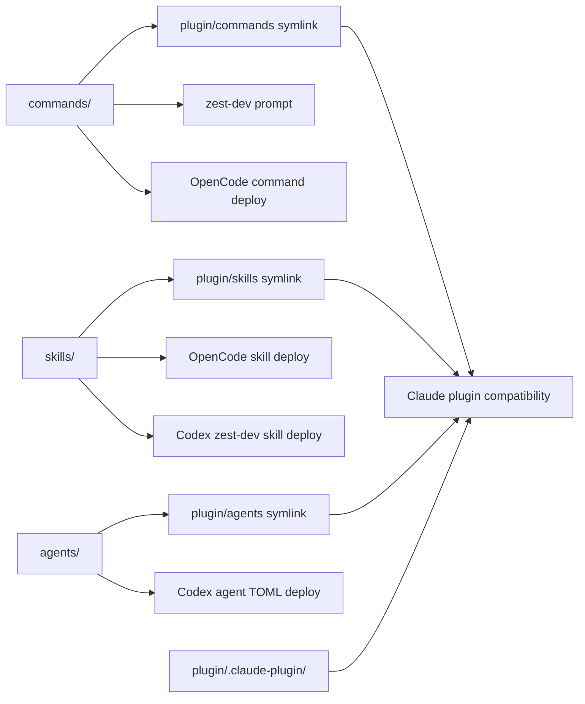

## Overview

### Problem Statement

项目里的 `skills`、`commands`、`subagents` 目前按 Claude Code plugin 的目录结构组织。现在主要使用环境不再以 Claude Code 为中心，需要让仓库结构更直接地面向通用 OpenCode / agent 资源布局。

### Goals

- 将资源目录平铺为顶层 `skills`、`commands`、`agents`。
- 保留 Claude Code plugin 兼容性：plugin 目录中通过 symlink 指向新的平铺目录。
- 让同一份资源内容可被新的主工作流使用，同时仍可被 plugin 方式加载。

### Scope

- 调整仓库内 skill、command、subagent/agent 资源的目录布局。
- 更新 plugin 目录下对应入口，使其通过 symlink 复用平铺目录。
- 更新必要的文档、部署或初始化逻辑，避免继续假设 Claude Code plugin 目录是主结构。

### Constraints

- 不以 Claude Code plugin 目录结构作为主要组织方式。
- plugin 兼容层不复制资源内容，应通过 symlink 连接到新目录。

### Success Criteria

- 顶层 `skills`、`commands`、`agents` 成为主要资源目录。
- Claude Code plugin 目录仍可用，且资源来自 symlink。
- 相关命令、文档和测试不再依赖旧的主目录假设。

## Research

### Existing System

- 当前主资源源目录是 `plugin/commands`、`plugin/skills`、`plugin/agents`；部署逻辑直接从这些路径读取。Source: `lib/plugin-deployer.js:248-249,279-280,305-307,326-328`
- `zest-dev prompt` 也直接从 `plugin/commands` 枚举和读取命令文件。Source: `lib/prompt-generator.js:4,9-13,34-41`
- `plugin/.claude-plugin/plugin.json` 是 Claude Code plugin 元数据，当前 plugin 目录仍可作为 Claude plugin source 使用。Source: `plugin/.claude-plugin/plugin.json:1-10`, `plugin/README.md:55-57`
- OpenCode 部署目标是 `.opencode/commands` 与 `.opencode/skills`，Codex 部署目标是 `.agents/skills/zest-dev` 与 `.codex/agents`。Source: `lib/plugin-deployer.js:113-128,131-154`
- `zest-dev init` 支持 global/local scope 和 all/opencode/codex target，默认 local 只部署 OpenCode，默认 global 部署 all。Source: `bin/zest-dev.js:242-258`, `lib/plugin-deployer.js:370-371`
- 部署到 OpenCode/Codex 当前是 copy-based：`copyDirectoryRecursive()` 递归复制文件，命令文件经 frontmatter 转换后写入目标目录。Source: `lib/plugin-deployer.js:228-240,248-272,291-315`
- 仓库已有 symlink 先例：active spec 用 `fs.symlinkSync()` 管理 `specs/change/active`。Source: `test/test-integration.js:131-141,539-575`

### Design Inputs

- command 部署会保留 `description` frontmatter，并移除 Claude Code 特有字段；测试覆盖该行为。Source: `lib/plugin-deployer.js:43-49,256-268`, `test/test-integration.js:196-218`
- skill phase 文件必须随 `zest-dev` skill 一起部署，测试检查 `new.md`、`research.md`、`design.md`、`implement.md`。Source: `test/test-integration.js:43,220-235`
- Codex agents 由 Markdown agent 定义转换为 TOML，测试检查三个固定文件。Source: `lib/plugin-deployer.js:326-345`, `test/test-integration.js:44,240-244`
- package 发布当前只包含 `plugin/`，如果资源源目录迁到顶层，需要更新 `files`。Source: `package.json:22-29`, `test/README.md:55-106`
- README 与 plugin README 仍描述 command/skill 的 plugin 路径，需要改为说明顶层资源目录与兼容 symlink。Source: `README.md:88-104`, `plugin/README.md:11-14,49-57,80-82`

### Constraints & Dependencies

- `zest-dev status` 会扫描 `.cursor/commands`、`.opencode/commands` 和全局 OpenCode commands 来显示 agent hint；测试覆盖 `.cursor` 与 OpenCode hint 行为。Source: `bin/zest-dev.js:24-51,112-120,133-139`, `test/test-integration.js:577-625`
- legacy cleanup 只删除已知 OpenCode legacy agent 文件和 Codex skill 里的旧 `zest-dev-*.md` command prompt，不能删除用户文件。Source: `lib/plugin-deployer.js:192-220`, `test/test-integration.js:254-315`
- debug-mode skill 中查找 `server.js` 的说明仍硬编码 `~/.claude/plugins`、`.cursor`、`.opencode`、`plugin/skills`。Source: `plugin/skills/debug-mode/SKILL.md:83-93`

### Key References

- `lib/plugin-deployer.js:248-400` - 核心部署读取源目录、复制 skills、转换 commands/agents。
- `lib/prompt-generator.js:4-41` - prompt 生成读取 command 源目录。
- `test/test-integration.js:144-391,577-751` - init、prompt、部署产物与兼容行为测试。
- `package.json:22-29` - npm package 包含文件。
- `plugin/README.md:11-14,49-57,80-82` - plugin 结构与 prompt 兼容文档。

## Design

### Architecture Overview

### Change Scope

- Impact Areas:
  - Area: Resource source layout. Impact: move canonical source content from `plugin/{commands,skills,agents}` to top-level `commands/`, `skills/`, `agents/`.
  - Area: Claude plugin compatibility. Impact: keep `plugin/.claude-plugin` and replace `plugin/{commands,skills,agents}` with symlinks to the top-level directories.
  - Area: CLI prompt/deploy logic. Impact: read canonical resources from top-level paths instead of plugin paths.
  - Area: Package and tests. Impact: include new directories in package files and assert symlink compatibility.
  - Area: Documentation. Impact: describe top-level resource layout as primary and plugin as compatibility layer.
- Planned File Changes:
  - `commands/` - new canonical command source directory, moved from `plugin/commands/`.
  - `skills/` - new canonical skill source directory, moved from `plugin/skills/`.
  - `agents/` - new canonical agent source directory, moved from `plugin/agents/`.
  - `plugin/commands`, `plugin/skills`, `plugin/agents` - symlinks to `../commands`, `../skills`, `../agents`.
  - `lib/plugin-deployer.js` - read top-level source directories and keep deployed outputs unchanged.
  - `lib/prompt-generator.js` - read top-level `commands/`.
  - `package.json` - include top-level resource directories in package contents.
  - `test/test-integration.js` - add assertions for package/deploy behavior and plugin symlinks.
  - `README.md`, `plugin/README.md`, `AGENTS.md` - update resource layout wording where needed.
  - `skills/debug-mode/SKILL.md` - update `server.js` lookup docs to include top-level `skills` and plugin symlink compatibility.

### Design Decisions

- Decision: Make top-level `commands/`, `skills/`, `agents/` the only canonical source directories; code should not read from `plugin/{commands,skills,agents}`. Source: `lib/plugin-deployer.js:248-249,279-280,305-307,326-328`, `lib/prompt-generator.js:4,34-41`
- Decision: Keep `plugin/.claude-plugin` as the plugin-specific metadata and use relative symlinks for `plugin/commands`, `plugin/skills`, `plugin/agents`. Source: `plugin/.claude-plugin/plugin.json:1-10`, `plugin/README.md:55-57`
- Decision: Preserve generated/deployed target layouts for OpenCode and Codex to avoid changing end-user install behavior. Source: `lib/plugin-deployer.js:113-154`, `test/test-integration.js:144-191,279-329`
- Decision: Keep command frontmatter transformation and Codex TOML conversion behavior unchanged, only change source paths. Source: `lib/plugin-deployer.js:43-49,248-272,326-345`, `test/test-integration.js:196-245`
- Decision: Update package contents to include the new canonical resource directories, because package tests are intended to catch missing packaged files. Source: `package.json:22-29`, `test/README.md:55-106`

### Why this design

- It makes OpenCode/agent resources first-class in the repository without removing Claude plugin compatibility.
- Symlinks avoid duplicated source content and keep plugin consumers pointed at the same files.
- Keeping deployment outputs unchanged limits the migration blast radius to source layout and source path resolution.

### Test Strategy

- Init deployment: run existing local test suite and assert OpenCode/Codex outputs remain unchanged. Source: `test/test-integration.js:144-391`
- Prompt generation: assert `zest-dev prompt` still supports the same command set after `COMMANDS_DIR` moves. Source: `test/test-integration.js:716-751`, `lib/prompt-generator.js:9-41`
- Symlink compatibility: add checks that `plugin/commands`, `plugin/skills`, and `plugin/agents` are symbolic links pointing at top-level directories. Source: `test/test-integration.js:131-141,539-575`
- Package coverage: run `pnpm test:package` so missing `commands/`, `skills/`, or `agents/` in `package.json.files` fails. Source: `package.json:22-29`, `test/setup-package-env.js:42-91`

### Pseudocode

Flow:
  1. Move `plugin/commands` → `commands`, `plugin/skills` → `skills`, `plugin/agents` → `agents`.
  2. Create relative symlinks:
     - `plugin/commands -> ../commands`
     - `plugin/skills -> ../skills`
     - `plugin/agents -> ../agents`
  3. Change deployer and prompt generator source constants to top-level paths.
  4. Update docs and debug-mode lookup text.
  5. Update tests and run local/package validation.

### File Structure

- `commands/` - canonical command markdown source.
- `skills/` - canonical skill source.
- `agents/` - canonical agent markdown source.
- `plugin/.claude-plugin/` - Claude plugin metadata.
- `plugin/commands -> ../commands` - compatibility symlink.
- `plugin/skills -> ../skills` - compatibility symlink.
- `plugin/agents -> ../agents` - compatibility symlink.

### Interfaces / APIs

- No CLI interface change: `zest-dev init`, `zest-dev prompt`, and spec lifecycle commands keep the same flags and output shape.
- Package contents change internally to include `commands/`, `skills/`, and `agents/`.

### Edge Cases

- npm package tarballs must preserve symlinks or at least include top-level resources used by runtime code.
- Existing generated `.opencode`, `.agents`, `.codex`, and `.cursor` directories are compatibility/deployment artifacts, not canonical sources.
- Local filesystem operations should fail loudly if expected source directories are missing after migration.

## Plan

- [x] Step 1: Migrate canonical resource layout
  - [x] Substep 1.1 Implement: move `plugin/commands`, `plugin/skills`, `plugin/agents` to top-level directories.
  - [x] Substep 1.2 Implement: create plugin compatibility symlinks for the three moved directories.
  - [x] Substep 1.3 Verify: inspect symlink targets and top-level resource contents.
- [x] Step 2: Update runtime source path consumers
  - [x] Substep 2.1 Implement: update deployer source paths to read top-level resources.
  - [x] Substep 2.2 Implement: update prompt generator to read top-level commands.
  - [x] Substep 2.3 Implement: update package files to include top-level resources.
  - [x] Substep 2.4 Verify: run prompt and init tests relevant to source path usage.
- [x] Step 3: Update tests and docs
  - [x] Substep 3.1 Implement: add symlink/resource-layout assertions to integration tests.
  - [x] Substep 3.2 Implement: update README/plugin/debug-mode docs for new canonical layout.
  - [x] Substep 3.3 Verify: run `pnpm test:local`.
- [x] Step 4: Package validation and final review
  - [x] Substep 4.1 Verify: run `pnpm test:package`.
  - [x] Substep 4.2 Verify: inspect git diff for unintended generated artifact changes.
  - [x] Substep 4.3 Implement: update spec Notes and mark implementation complete if all validation passes.

## Notes

### Implementation

- `commands/` - new canonical command source directory, moved from `plugin/commands`.
- `skills/` - new canonical skill source directory, moved from `plugin/skills`; updated debug-mode `server.js` lookup docs to prefer top-level `skills/`.
- `agents/` - new canonical agent source directory, moved from `plugin/agents`.
- `plugin/commands`, `plugin/skills`, `plugin/agents` - replaced with relative symlinks to the new top-level directories.
- `lib/plugin-deployer.js` - deploys commands, skills, Codex skill, and Codex agents from top-level source directories.
- `lib/prompt-generator.js` - reads command prompt sources from top-level `commands/`.
- `package.json` - includes `commands/`, `skills/`, and `agents/` in package contents.
- `scripts/ensure-plugin-symlinks.js` - recreates plugin compatibility symlinks after npm install, because `npm pack` does not preserve symlink entries.
- `test/test-integration.js` - asserts plugin resource directories are compatibility symlinks.
- `README.md`, `plugin/README.md` - document canonical top-level resources and plugin compatibility symlinks.

### Verification

- `ls -l plugin` - confirmed `plugin/agents -> ../agents`, `plugin/commands -> ../commands`, `plugin/skills -> ../skills`.
- reviewer subagent - identified package symlink and debug-mode lookup issues; both were addressed.
- `node scripts/ensure-plugin-symlinks.js` - passed with existing source symlinks.
- `pnpm test:local` - passed, 40 passed / 1 skipped.
- `pnpm test:package` - passed, 41 tests.
- `git status --short` and `git diff --stat` - reviewed changed files; resource moves and new symlinks are intentional.
