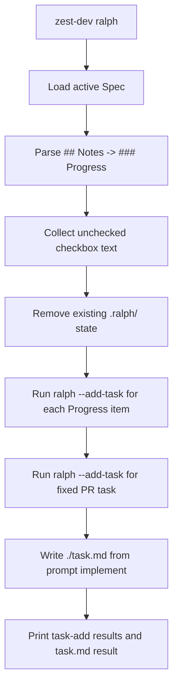

## Overview

Add a `zest-dev ralph` command that converts a Spec's `## Notes` -> `### Progress` checklist into Ralph Tasks.

The command should be deterministic and programmatic, not LLM-based. The goal is to let a planned Zest Dev Spec become Ralph's task-mode input without manually copying checklist items.

## Research

### Existing System

- Issue 62 requests a new `zest-dev ralph` command that converts spec `progress` into `ralph tasks`, and explicitly says to use a programmatic approach rather than an LLM. Source: https://github.com/nettee/zest-dev/issues/62
- Specs live under `specs/change/<YYYYMMDD-slug>/`, and only directory names matching `^\d{8}-` are recognized. Source: `lib/spec-manager.js:32-41`
- The active Spec is resolved from `specs/change/active`, with legacy fallback to `specs/change/current`. Source: `lib/spec-manager.js:6-8,71-72`
- `getSpec("active")` fails immediately when no active change spec exists. Source: `lib/spec-manager.js:157-160`
- Current valid Spec statuses include `new`, `researched`, `designed`, `planned`, and `implemented`. Source: `lib/spec-manager.js:11-18`
- The CLI currently defines commands for status, show, create, set-active, unset-active, update, create-branch, init, and prompt; there is no `ralph` command handler yet. Source: `bin/zest-dev.js:128-270`
- `zest-dev prompt <command>` delegates prompt generation to `generatePrompt(command, args)`. Source: `bin/zest-dev.js:265-270`; `lib/prompt-generator.js:19-42`
- Prompt generation reads `commands/<command>.md`, strips YAML frontmatter, replaces `$ARGUMENTS`, trims whitespace, and returns the prompt. Source: `lib/prompt-generator.js:19-42`
- The implement command prompt lives in `commands/implement.md`. Source: `commands/implement.md:1-10`
- The Plan Phase writes `## Notes` -> `### Progress` as one checkbox per Plan step, and says this checklist tracks implementation progress rather than describing the plan. Source: `skills/zest-dev/plan.md:54-65`
- The Implement Phase marks the matching Progress checkbox `[x]` only when that Plan step is complete and relevant tests pass. Source: `skills/zest-dev/implement.md:1-18`

### Design Inputs

- Project language distinguishes a `Plan Step` from a task or ticket; it is an issue-scale implementation slice in the Spec's Plan section. Source: `CONTEXT.md:39-41`
- Planned Status means the Spec's Design and Plan sections are ready for implementation. Source: `CONTEXT.md:35-37`
- Ralph stores task-mode files in the current working directory's `.ralph` folder, with tasks at `.ralph/ralph-tasks.md`. Source: `/Users/william/.nvm/versions/node/v24.13.0/lib/node_modules/@th0rgal/ralph-wiggum/ralph.ts:20-24`
- Ralph `--add-task` creates `.ralph/ralph-tasks.md` with `# Ralph Tasks` when missing and appends top-level `- [ ] <description>` items. Source: `/Users/william/.nvm/versions/node/v24.13.0/lib/node_modules/@th0rgal/ralph-wiggum/ralph.ts:616-640`
- Ralph parses top-level tasks with `- [ ]`, `- [/]`, and `- [x]`, and parses indented checkbox items as subtasks. Source: `/Users/william/.nvm/versions/node/v24.13.0/lib/node_modules/@th0rgal/ralph-wiggum/ralph.ts:731-769`
- Ralph Tasks Mode tells agents to mark the next unchecked task as `[/]`, mark verified completed tasks as `[x]`, and only finish when all tasks are `[x]`. Source: `/Users/william/.nvm/versions/node/v24.13.0/lib/node_modules/@th0rgal/ralph-wiggum/ralph.ts:1395-1447`
- Ralph's README says Tasks Mode stores tasks in `.ralph/ralph-tasks.md` and supports `ralph --list-tasks`, `ralph --add-task`, and `ralph --remove-task`. Source: `/Users/william/.nvm/versions/node/v24.13.0/lib/node_modules/@th0rgal/ralph-wiggum/README.md:221-251`

### Constraints & Dependencies

- The command must not rely on an LLM for conversion. Source: https://github.com/nettee/zest-dev/issues/62
- Zest Dev's "let it crash" rule requires missing required inputs, invalid state, and failed required steps to fail immediately with clear errors rather than silently substituting defaults. Source: `AGENTS.md:33-50`
- CLI errors are expected to print a clear message and exit non-zero. Source: `bin/zest-dev.js:132-145,152-159,166-172,218-225`

### Key References

- `bin/zest-dev.js:128-270` - current CLI command registration shape.
- `lib/spec-manager.js:6-18,32-41,157-160` - active Spec lookup and status model.
- `skills/zest-dev/plan.md:54-65` - canonical Progress Checklist format.
- `/Users/william/.nvm/versions/node/v24.13.0/lib/node_modules/@th0rgal/ralph-wiggum/ralph.ts:20-24,616-640,731-769,1395-1447` - Ralph task path, file creation, markdown parsing, and workflow.

## Design

### Design Summary

Add `zest-dev ralph` as a CLI command that reads the active Spec, extracts unfinished implementation items, resets local Ralph state, and creates Ralph Tasks by invoking Ralph's own task-management CLI.

### Design Decisions

- Decision: `zest-dev ralph` operates only on the active Spec; it does not accept a Spec id argument in this change. If there is no active Spec, it fails fast with the same clear-error pattern as other CLI commands. Source: user decision; `lib/spec-manager.js:157-160`; `bin/zest-dev.js:132-145,152-159,218-225`; `AGENTS.md:33-50`
- Decision: `zest-dev ralph` must not write `.ralph/ralph-tasks.md` directly or assume Ralph's internal task-file format. It should clear existing `.ralph/` state first and create tasks by running `ralph --add-task "<description>"` for each generated task. Source: user decision; `/Users/william/.nvm/versions/node/v24.13.0/lib/node_modules/@th0rgal/ralph-wiggum/README.md:231-245`; `/Users/william/.nvm/versions/node/v24.13.0/lib/node_modules/@th0rgal/ralph-wiggum/ralph.ts:616-640`
- Decision: Only unfinished items are converted into Ralph Tasks; completed items are skipped. Source: user decision; `skills/zest-dev/implement.md:17-18`
- Decision: The conversion source is only `## Notes` -> `### Progress` checkbox items. The command should not infer tasks from `## Plan`; if the Progress section is missing, malformed, or contains unsupported checkbox syntax, it fails fast with a clear error. Source: user decision; `skills/zest-dev/plan.md:54-65`; `AGENTS.md:33-50`
- Decision: Each unfinished Progress checkbox becomes one Ralph Task using the checkbox text exactly as written after the marker. Source: user decision; `skills/zest-dev/plan.md:54-65`
- Decision: After all unfinished Progress items are added, append a fixed final Ralph Task: `Make sure all tasks are done in ralph loops, and then create PR. If there is a related issue, make sure to link it in the PR.` Source: user decision
- Decision: `zest-dev ralph` writes the implement command prompt into project-root `./task.md`, overwriting any existing content. The prompt content comes from the same generator used by `zest-dev prompt implement`. Source: user decision; `bin/zest-dev.js:265-270`; `lib/prompt-generator.js:19-42`; `commands/implement.md:1-10`
- Decision: `zest-dev ralph` executes the setup workflow in one run: add Ralph tasks, write `task.md`, then print the results of both steps for human confirmation. Any required operation that fails, including Ralph state cleanup, any `ralph --add-task`, or writing `task.md`, causes an immediate non-zero failure. Source: user decision; `AGENTS.md:33-50`; `bin/zest-dev.js:132-145,152-159,218-225`; `/Users/william/.nvm/versions/node/v24.13.0/lib/node_modules/@th0rgal/ralph-wiggum/README.md:231-245`

### System Procedure

### Interfaces / APIs

- CLI: `zest-dev ralph`
- Input: the active Spec's `## Notes` -> `### Progress` checkbox list.
- Generated Ralph Tasks:
  - One task per unfinished Progress checkbox, using the checkbox text exactly.
  - One final fixed task: `Make sure all tasks are done in ralph loops, and then create PR. If there is a related issue, make sure to link it in the PR.`.
- Generated prompt file: project-root `task.md`, overwritten with `generatePrompt("implement")`.
- Output: command output should show the `ralph --add-task` results and the `task.md` write result so the user can inspect what happened.

### Change Scope

Impact Areas:

- CLI command surface: add a new `zest-dev ralph` command.
- Spec parsing: add deterministic markdown section/checkbox extraction for Progress.
- Ralph setup integration: clear `.ralph/`, call Ralph CLI task commands, and surface subprocess failures.
- Prompt generation reuse: write the existing implement prompt to `./task.md`.
- Tests: cover active-spec lookup, Progress parsing, fail-fast errors, Ralph subprocess integration, and `task.md` generation.

Planned File Changes:

- `bin/zest-dev.js` - register `ralph` command and wire command errors through existing CLI error handling.
- `lib/spec-manager.js` or a new helper under `lib/` - expose enough active Spec content/path access for conversion.
- `lib/prompt-generator.js` - reuse existing `generatePrompt("implement")`; no behavior change expected unless tests need export coverage.
- `test/test-integration.js` - add integration tests for `zest-dev ralph`.

### Edge Cases

- No active Spec: fail fast.
- Active Spec has no `## Notes` -> `### Progress`: fail fast.
- Progress section contains non-checkbox content, nested subtasks, or unsupported checkbox markers: fail fast.
- Progress section has only completed `[x]` items: create only the fixed final PR task.
- Existing `.ralph/` directory exists: remove it before adding tasks.
- `ralph` executable is missing or any `ralph --add-task` exits non-zero: fail fast.
- `task.md` already exists: overwrite it.

### Verification Strategy

- Add tests that create an active planned Spec with mixed `[ ]` and `[x]` Progress items, run `zest-dev ralph`, and verify only unfinished Progress text plus the fixed PR task are passed to Ralph. Source: `skills/zest-dev/plan.md:54-65`; user decision
- Add tests for fail-fast behavior when no active Spec exists and when Progress is missing or malformed. Source: `lib/spec-manager.js:157-160`; `AGENTS.md:33-50`
- Add tests that existing `.ralph/` state is cleared before task creation. Source: user decision
- Add tests that `task.md` is overwritten with the same content as `zest-dev prompt implement`. Source: `lib/prompt-generator.js:19-42`; `commands/implement.md:1-10`

## Plan

### Step 1: Parse active Progress into task text

Type: AFK
Goal: Deterministically read the active Spec and extract unfinished Progress checkbox text.
Scope: Add or reuse helpers for active Spec content loading, Progress section detection, checkbox parsing, and fail-fast validation errors.
Depends on: None

### Step 2: Execute Ralph setup workflow

Type: AFK
Goal: Convert parsed Progress items into Ralph Tasks without assuming Ralph's task-file format.
Scope: Remove existing `.ralph/`, run `ralph --add-task` for each unfinished Progress item plus the fixed PR task, fail on subprocess errors, and print task-add results.
Depends on: Step 1

### Step 3: Write implement prompt file

Type: AFK
Goal: Produce the prompt file Ralph or an agent can use to implement the active Spec.
Scope: Generate the existing implement prompt, overwrite project-root `task.md`, and print the write result.
Depends on: Step 1

### Step 4: Integrate CLI tests and command help

Type: AFK
Goal: Make the command reliable and visible in the CLI.
Scope: Register `zest-dev ralph`, add focused integration tests for success and fail-fast cases, and verify the local test suite.
Depends on: Step 2, Step 3

## Notes

### Progress

- [x] Step 1: Parse active Progress into task text
- [x] Step 2: Execute Ralph setup workflow
- [x] Step 3: Write implement prompt file
- [x] Step 4: Integrate CLI tests and command help

### Implementation

- Added `lib/ralph-setup.js` to parse active Spec `## Notes` -> `### Progress`, fail on malformed/missing Progress input, clear `.ralph/`, call `ralph --add-task`, and overwrite `task.md` with `generatePrompt("implement")`.
- Added `zest-dev ralph` CLI wiring in `bin/zest-dev.js` using the existing YAML output and fail-fast error style.
- Added integration coverage with a fake `ralph` executable for success, all-complete Progress fail-fast behavior, missing active Spec, missing Progress, malformed Progress, `.ralph` cleanup, and `task.md` generation.

### Verification

- `pnpm test:local` - passed, 47 pass / 1 skip.
- `pnpm test:package` - passed, 48 pass.
- Manual case check with `/Users/william/projects/vela-wt-model-priority/specs/change/20260604-runtime-catalog-route-weights-config/spec.md`: original all-complete Progress fails fast; temporary unchecked copy generates three Step tasks plus the fixed PR task.
