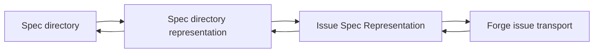

# Design

## Research

### Existing System

- The CLI uses `commander`; commands call `lib/spec-manager` functions, print YAML on success, and exit non-zero on caught errors. Source: `bin/zest-dev.js:124-227`
- `zest-dev` is exposed as `./bin/zest-dev.js`; the package includes `bin/`, `lib/`, templates, commands, skills, scripts, plugin files, README, and license. Source: `package.json:19-33`
- Specs live under `specs/change`; the active link is `specs/change/active`, with legacy `current` compatibility. Source: `lib/spec-manager.js:6-8,81-82`
- Spec directories are recognized only when their names start with `YYYYMMDD-`. Source: `lib/spec-manager.js:33-42`
- The Main Spec File is `spec.md`, with legacy `README.md` fallback. Source: `lib/spec-manager.js:145-156`
- Creating a Spec writes three files: `spec.md`, `design.md`, and `steps.md`. Source: `lib/spec-manager.js:222-233`
- The Spec status lifecycle is `new`, `researched`, `designed`, `planned`, `implemented`, and updates are forward-only. Source: `lib/spec-manager.js:12-19,335-337`
- `show` returns Spec metadata only; it does not return file contents or supporting file paths. Source: `lib/spec-manager.js:162-189`
- `update` modifies only the Main Spec File frontmatter status. Source: `lib/spec-manager.js:335-358`

### Design Inputs

- Project vocabulary defines a Spec as a directory containing a Main Spec File and optional Spec Supporting Files. Source: `CONTEXT.md:5-18`
- The Main Spec File is review-oriented, while Spec Supporting Files carry lower-review-frequency workflow detail. Source: `CONTEXT.md:11-18`
- Issue #98 requests converting a Spec between file form and issue form. Source: `https://github.com/nettee/zest-dev/issues/98`
- User requirement: the process must be programmatic, must not use an LLM, and must be lossless. Source: user request in this spec session, 2026-06-27
- User requirement: issue body should carry the Main Spec File, each supporting file should be an issue comment, and metadata should make dump/load smooth. Source: user request in this spec session, 2026-06-27
- User requirement: the EAG can use a test Spec for one dump and one load, then verify no information changed. Source: user request in this spec session, 2026-06-27
- User requirement: future support must include Forgejo, not only GitHub. Source: user request in this spec session, 2026-06-27

### Constraints & Dependencies

- The repository's fast-fail rule requires required missing inputs, malformed protocol data, failed subprocesses, and violated invariants to fail clearly instead of continuing with placeholders or fabricated data. Source: `AGENTS.md:12-41`
- E2E tests run the real CLI as subprocesses and parse YAML stdout. Source: `e2e/tests/conftest.py:43`
- Lifecycle tests already cover split template creation, active/legacy behavior, and status transitions. Source: `e2e/tests/test_spec_lifecycle.py:9-63,100-151,206-239`
- Package testing packs and installs the CLI tarball before running the same pytest suite. Source: `package.json:34-38`, `e2e/helpers/package_env.py:29`

### Key References

- `bin/zest-dev.js:129-280` - current command registration pattern.
- `lib/spec-manager.js:195-244` - create flow and split Spec file layout.
- `lib/template/spec.md:1-29` - Main Spec File template and links to supporting files.
- `lib/template/design.md:1-5` - Design supporting file template.
- `lib/template/steps.md:1-5` - Steps supporting file template.
- `docs/issue-spec-representation.md:1-199` - Issue Spec Representation v1 protocol.

## Design Detail

### Architecture Overview

### Design Decisions

- Decision: The Issue Spec Representation is self-describing and forge-neutral. Required protocol data lives in the issue body and comments; title and labels are human-facing hints, not required load inputs. Source: `CONTEXT.md:19-22`, user confirmation in this spec session, 2026-06-27
- Decision: Losslessness is Markdown-file losslessness for Spec files, not a general-purpose filesystem mirror. Source: `CONTEXT.md:7-22`, user confirmation in this spec session, 2026-06-27
- Decision: Separate the pure representation protocol from forge transport adapters. Source: `package.json:19-33`, `bin/zest-dev.js:124-227`, user confirmation in this spec session, 2026-06-27
- Decision: One issue corresponds to one Spec directory and carries one complete Spec snapshot. Source: user confirmation in this spec session, 2026-06-27
- Decision: Represent each file as renderable Markdown content with machine metadata in an HTML comment header at the beginning. Source: user confirmation in this spec session, 2026-06-27
- Decision: Keep protocol metadata minimal: preserve Spec id, file paths, and file content; do not include role or sha256 fields. Source: user confirmation in this spec session, 2026-06-27
- Decision: The loaded Spec identity comes from the protocol header `spec-id`, not from Main Spec File frontmatter, issue title, labels, issue number, or URL. Source: `docs/issue-spec-representation.md:131-153`, user confirmation in this spec session, 2026-06-27
- Decision: `dump` publishes a new issue snapshot and does not update existing issues. Source: user confirmation in this spec session, 2026-06-27
- Decision: `load` creates the Spec directory but does not change the active Spec by default. Source: `lib/spec-manager.js:247-278`, user confirmation in this spec session, 2026-06-27
- Decision: CLI commands stay forge-neutral as `dump` and `load`; the forge is inferred from the default git remote, falling back to GitHub when inference fails. Source: `package.json:9`, `git remote -v`, user confirmation in this spec session, 2026-06-27
- Decision: Issue title and labels are human-facing archive metadata, not authoritative load inputs. Source: user confirmation in this spec session, 2026-06-27
- Decision: `load` ignores non-protocol issue comments. Source: user confirmation in this spec session, 2026-06-27
- Decision: Supporting-file comments are matched to files by the `path` field in their protocol HTML comment header. Source: user confirmation in this spec session, 2026-06-27
- Decision: Supporting-file paths may include subdirectories; they are not limited to top-level Markdown files. Source: user confirmation in this spec session, 2026-06-27
- Decision: `dump` includes every Markdown file under the Spec directory, with `spec.md` in the issue body and all other Markdown files in protocol comments. Source: user confirmation in this spec session, 2026-06-27
- Decision: `dump` fails when the Spec directory contains non-Markdown files. Source: user confirmation in this spec session, 2026-06-27
- Decision: The issue dump/load protocol does not support legacy `README.md` main files; Specs must use `spec.md`. Source: `lib/spec-manager.js:145-156`, user confirmation in this spec session, 2026-06-27
- Decision: First-version remote transport implements GitHub only; Forgejo remains a future adapter behind the forge-neutral protocol boundary. Source: `package.json:9`, `git remote -v`, user confirmation in this spec session, 2026-06-27
- Decision: The first GitHub transport uses the `gh` CLI. Source: user confirmation in this spec session, 2026-06-27
- Decision: Remote `dump` is not transactional; if issue creation succeeds but later comment creation fails, the command fails and reports the created issue URL. Source: user confirmation in this spec session, 2026-06-27
- Decision: Provide a local representation mode for dry-run, diagnostics, and EAG validation without network access. Source: user confirmation in this spec session, 2026-06-27
- Decision: The Issue Spec Representation protocol is documented as a project doc and treated as an implementation contract. Source: `docs/issue-spec-representation.md:1-199`, user request in this spec session, 2026-06-27

### Change Scope

Impact Areas:
- CLI commands: add `dump` and `load` commands with local and GitHub-backed modes.
- Spec manager: add pure functions for reading/writing Spec directories and rendering/parsing Issue Spec Representations.
- Forge transport: add a GitHub adapter using `gh`; keep Forgejo behind the same adapter boundary for later implementation.
- Documentation: add and maintain the Issue Spec Representation protocol document.
- E2E tests: validate local round-trip, fail-fast behavior, command wiring, package installation, and GitHub adapter subprocess behavior.

Planned File Changes:
- `docs/issue-spec-representation.md` - protocol contract for issue body/comment representation.
- `lib/spec-manager.js` - core local representation, load/dump orchestration, exports.
- `bin/zest-dev.js` - command registration and CLI option parsing.
- `e2e/tests/test_spec_lifecycle.py` or a new e2e test file - dump/load behavior and fail-fast coverage.
- `README.md` or command docs - user-facing usage notes if command behavior changes documented CLI surface.

### Interfaces / APIs

- `zest-dev dump <spec|active> --dry-run` emits a local Issue Spec Representation.
- `zest-dev dump <spec|active>` creates a new forge issue snapshot; first implementation supports GitHub through `gh`.
- `zest-dev load --from-file <path>` loads from a local representation artifact.
- `zest-dev load <issue-url-or-number>` loads from a remote issue through the inferred forge adapter.
- Core functions should expose a local conversion path equivalent to `Spec directory -> Issue Spec Representation -> Spec directory`.

### Test Strategy

- EAG: create a test Spec directory with `spec.md`, top-level supporting Markdown, and nested supporting Markdown; dump to local representation; load into a fresh directory; compare relative Markdown paths and exact file content. Source: `docs/issue-spec-representation.md:98-129,155-183`
- Fail-fast tests: missing `spec.md`, non-Markdown file, invalid path, duplicate protocol path, missing body protocol header, missing or invalid `spec-id`, mismatched comment `spec-id`, and existing target directory. Source: `docs/issue-spec-representation.md:185-199`
- CLI tests: verify `dump --dry-run` and `load --from-file` parse arguments, output YAML, do not modify active symlink, and run in local/package environments. Source: `bin/zest-dev.js:129-280`, `e2e/tests/conftest.py:43`, `package.json:34-38`
- GitHub adapter tests: stub `gh` subprocesses to verify issue title, labels, body, comments, issue reads, and partial-failure reporting. Source: `docs/issue-spec-representation.md:81-96,185-199`

### Edge Cases

- Non-protocol issue comments are ignored during load.
- Protocol comment order is irrelevant.
- Duplicate protocol paths fail.
- Legacy `README.md` main files fail.
- Forgejo inference before adapter support fails with an unsupported-forge error.
- Remote dump partial failure returns failure and reports the created issue URL without cleanup mutation.

### Pseudocode

Dump flow:
1. Resolve `<spec|active>` to a Spec directory.
2. Require `spec.md`.
3. Walk the directory and collect Markdown files; fail on non-Markdown files.
4. Render issue body from `spec.md` and protocol comments from all other Markdown files.
5. For `--dry-run`, print local representation.
6. Otherwise infer forge, require supported transport, create issue, then create comments.

Load flow:
1. Read local representation or remote issue body/comments.
2. Require body protocol header with `path: spec.md`.
3. Parse protocol comments and ignore ordinary comments.
4. Validate relative Markdown paths and duplicate paths.
5. Read `spec-id` from the body protocol header and derive target `specs/change/<spec-id>/`.
6. Fail if target exists.
7. Write all represented Markdown files.

### Derived Rules

- `load` must parse the protocol blocks from issue body/comments instead of inferring required Spec metadata from title or labels.
- Missing protocol markers, unsupported protocol versions, malformed metadata, missing required files, duplicate file paths, or path/content mismatches in round-trip tests are hard failures.
- GitHub and Forgejo integrations should adapt issue body/comments/title/labels to the same Issue Spec Representation rather than owning separate Spec protocols.
- `dump` includes the Main Spec File and Markdown Spec Supporting Files inside the Spec directory.
- `dump` does not need to support symlinks, non-Markdown files, binary files, or arbitrary nested filesystem state.
- `load` verifies the represented Markdown file paths are valid and unique, then writes those Markdown files back to a Spec directory.
- Core protocol functions convert `Spec directory <-> Issue Spec Representation` without network access or forge-specific APIs.
- GitHub and Forgejo code should only adapt remote issue body/comments/title/labels to the core Issue Spec Representation.
- The EAG should validate the pure local protocol round trip first; live forge API checks can be separate integration coverage.
- `dump` emits the complete represented Markdown file set for the Spec directory.
- `load` reconstructs one Spec directory from one complete issue representation and does not merge with an existing local Spec.
- If the target Spec directory already exists, first-version `load` fails instead of overwriting or partially merging.
- Missing, duplicate, or manifest-inconsistent comments are hard failures.
- The issue body begins with a protocol HTML comment header for the Main Spec File, followed by the raw Markdown content of that file.
- Each supporting-file comment begins with a protocol HTML comment header for that file, followed by the raw Markdown content of that file.
- The parser reads only the leading protocol HTML comment as metadata; all remaining comment/body text is file Markdown content and must round-trip unchanged under the Markdown-file losslessness boundary.
- The issue body does not need a `role` metadata field because the body is always the Main Spec File.
- Supporting-file comments do not need a `role` metadata field because comments always represent Spec Supporting Files.
- The EAG should compare loaded file paths and file content exactly, instead of relying on protocol checksum fields.
- `load` reads `spec-id` from the body protocol header.
- Every protocol comment must repeat the same `spec-id`.
- `load` creates `specs/change/<spec-id>/` from the header `spec-id`.
- Missing `spec-id`, mismatched comment `spec-id`, or a `spec-id` that is not a valid `YYYYMMDD-*` Spec directory name is a hard failure.
- Issue title and labels are not authoritative for reconstructing the Spec.
- `dump` should not accept an existing issue as a target for mutation.
- Existing issue update, comment deletion, comment reordering, and remote conflict reconciliation are out of scope.
- Multiple dumps of the same Spec produce multiple issue snapshots.
- `load` outputs the loaded Spec metadata and source issue information without modifying `specs/change/active`.
- Users can run `zest-dev set-active <spec-id>` explicitly after load.
- A future convenience option such as `--set-active` must be explicit if added.
- `dump` and `load` user-facing command names must not be GitHub-specific.
- The first implementation should inspect the default remote, infer GitHub or Forgejo when possible, and use GitHub as the default when the remote is ambiguous.
- Explicit forge selection can be an override option, but normal usage should not require it when the repository remote is enough.
- `dump` creates issue titles as `[archive] <spec-id>`.
- `dump` labels created issues with `spec:change` and `archive`.
- `load` must not require or trust the issue title or labels when reconstructing the Spec.
- `load` parses only issue body/comment content that starts with the Zest Dev protocol HTML comment header.
- Ordinary issue comments without the protocol header are ignored.
- Each protocol supporting-file comment must include a valid relative Markdown `path`.
- Duplicate protocol comment paths are hard failures.
- Protocol comment order is not meaningful.
- Valid file paths must still be relative paths within the target Spec directory.
- Absolute paths, parent-directory traversal, empty paths, and non-Markdown paths are hard failures.
- `dump` discovers Markdown files by walking the Spec directory rather than parsing links in `spec.md`.
- Every discovered Markdown file except `spec.md` becomes one protocol issue comment.
- Unsupported non-Markdown files must not be silently ignored.
- `dump` fails when `spec.md` is missing, even if a legacy `README.md` exists.
- `load` always restores the issue body content to `spec.md`.
- If remote inference identifies Forgejo before a Forgejo adapter exists, commands fail with a clear unsupported-forge error.
- GitHub implementation choices must not leak into the protocol format.
- Missing `gh`, failed `gh auth`, failed issue creation, failed comment creation, and failed issue reads are hard failures.
- The implementation should not add a GitHub HTTP client dependency for the first version.
- The implementation should not silently close, delete, or mutate partially created issues after a later failure.
- Failure output should include enough remote issue information for the user to inspect or clean up manually.
- `dump --dry-run` should emit the Issue Spec Representation without creating a remote issue.
- `load --from-file <path>` should load from a local representation artifact.
- The EAG should use local representation mode to prove protocol losslessness without depending on forge availability.
