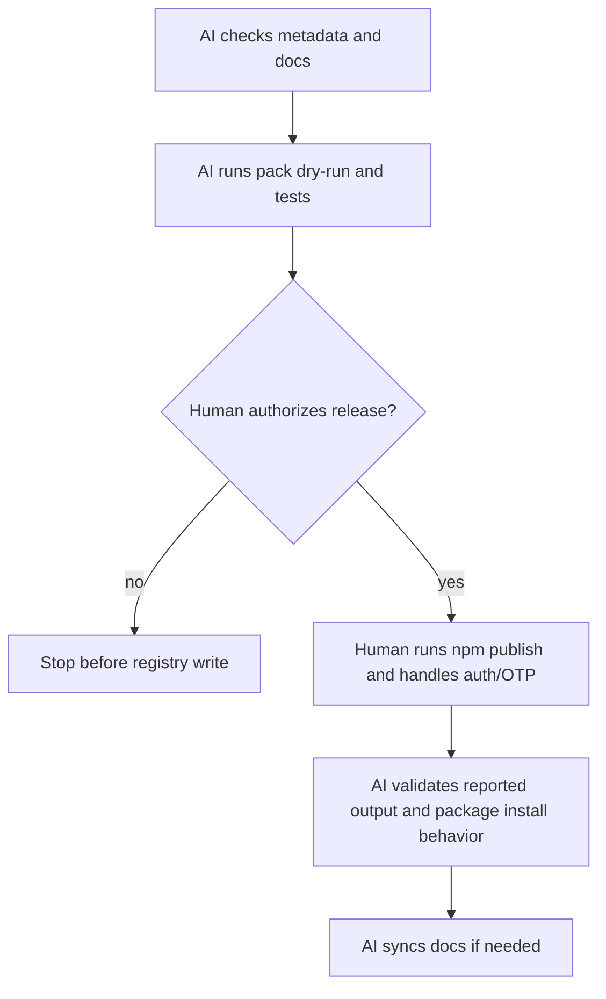

# Design

## Research

### Existing System

- The package is named `zest-dev`, version `0.1.0`, licensed MIT, and includes npm metadata for author, repository, keywords, dependencies, and scripts. Source: `package.json:1-47`
- The package exposes the CLI through `bin.zest-dev = ./bin/zest-dev.js`. Source: `package.json:18-21`
- The CLI binary has a Node shebang and registers the `zest-dev` program name, description, and version `0.1.0`. Source: `bin/zest-dev.js:1`, `bin/zest-dev.js:126-129`
- The package `files` allowlist includes `bin/`, `commands/`, `skills/`, `agents/`, `lib/`, `scripts/`, `plugin/`, `index.js`, `README.md`, and `LICENSE`. Source: `package.json:22-33`
- README currently documents local development via `npm install` and `npm link`, but its Quick Start assumes `zest-dev` is already installed. Source: `README.md:5-27`
- Local and package tests are available as `pnpm test:local` and `pnpm test:package`. Source: `package.json:34-38`, `e2e/README.md:12-29`
- Package E2E testing runs `npm pack`, installs the produced tarball into an isolated package environment, and checks `npx zest-dev --version`. Source: `e2e/helpers/package_env.py:29-50`
- The E2E suite covers local and packaged CLI execution paths and required setup/package install failure visibility. Source: `e2e/README.md:31-43`
- `.gitignore` excludes generated package tarballs and optional npm cache output. Source: `.gitignore:71-84`

### Design Inputs

- `npm pack --dry-run --json` currently reports package `zest-dev@0.1.0`, 39 entries, and includes the intended CLI, library, command, skill, agent, plugin, README, LICENSE, script, and package files. Source: local command `npm pack --dry-run --json`, 2026-06-30
- `npm pack --dry-run` warns that no `.npmignore` exists and npm is using `.gitignore` for file exclusion. Source: local command `npm pack --dry-run --json`, 2026-06-30
- The public npm registry already has `zest-dev` at version `0.1.0`. Source: local command `npm view zest-dev version --json`, 2026-06-30
- npm documents `npm pack --dry-run` as a no-change way to report what would be packed, and says dry-run is honored by `pack` and `publish`. Source: npm docs, `npm-pack`, Description / Configuration: dry-run, https://docs.npmjs.com/cli/v11/commands/npm-pack/
- npm documents `npm publish <package-spec>` as publishing to the registry, with the public npm registry as default unless overridden. Source: npm docs, `npm-publish`, Description, https://docs.npmjs.com/cli/v11/commands/npm-publish/
- npm documents `name` and `version` as required for publishing, semver-compatible versions, `private: true` as publish-blocking, `files` as package content control, and `bin` as the standard CLI executable mapping. Source: npm docs, `package-json`, `name`, `version`, `private`, `files`, `bin`, https://docs.npmjs.com/cli/v11/configuring-npm/package-json/
- npm documents that 2FA publishing requires a second authentication step and that `otp` is a one-time password; if omitted and challenged, npm prompts on the command line. Source: npm docs, Two-factor authentication / `npm-publish` Configuration: otp, https://docs.npmjs.com/about-two-factor-authentication/, https://docs.npmjs.com/cli/v11/commands/npm-publish/
- npm documents granular access tokens as website-created; CLI creation is not currently supported. Source: npm docs, Creating and viewing access tokens, https://docs.npmjs.com/creating-and-viewing-access-tokens/
- npm provenance requires supported cloud CI/CD, such as GitHub Actions or GitLab CI/CD; first publish with provenance uses `npm publish --provenance --access public`. Source: npm docs, Generating provenance statements, https://docs.npmjs.com/generating-provenance-statements/

### Constraints & Dependencies

- Registry writes and npm account authentication are human-sensitive and should not be performed by AI without explicit instruction.
- This repository's safety rules prefer fail-fast behavior and forbid hidden fallback data that makes a failed required step look successful. Source: `AGENTS.md:12-41`
- The first implementation must handle the already-published `0.1.0` fact by choosing a publishable next version or intentionally deciding not to publish until ownership/version is resolved. Source: local command `npm view zest-dev version --json`, 2026-06-30
- If provenance is required, CI/trusted publishing setup may be a separate workflow because this repository currently has no `.github/workflows/` files. Source: file search `.github/workflows/*`, 2026-06-30

### Key References

- `package.json:1-47` - package metadata, bin mapping, files allowlist, scripts, dependencies.
- `bin/zest-dev.js:1,126-129` - executable shebang and CLI version registration.
- `README.md:5-27` - current install/setup documentation gap.
- `e2e/helpers/package_env.py:29-50` - package E2E pack/install/version flow.
- `e2e/README.md:31-43` - packaged CLI behavior coverage and failure policy.
- npm docs: `npm-pack`, `npm-publish`, `package-json`, 2FA, tokens, and provenance pages listed above.

## Design Detail

### Design Decisions

- Decision: Use a manual npm publish gate rather than fully automating publish from the agent, because npm publish writes to the public registry and may require human OTP/token handling. Source: npm 2FA docs and `npm-publish` `otp` configuration; safety boundary from user requirement for HITL steps
- Decision: Keep the package content source as the existing `package.json` `files` allowlist, but require `npm pack --dry-run --json` inspection before publishing. Source: `package.json:22-33`, npm `package-json` `files` docs, npm `npm-pack` dry-run docs
- Decision: Treat `pnpm test:package` as the EAG because it packs, installs, and runs the CLI from an isolated package environment. Source: `package.json:34-38`, `e2e/helpers/package_env.py:29-50`
- Decision: Require explicit version handling before publish because npm already reports `zest-dev` version `0.1.0`. Source: local command `npm view zest-dev version --json`, 2026-06-30
- Decision: Document a plain local publish path first; defer CI/trusted publishing unless the Human chooses provenance as a release requirement. Source: npm provenance docs; `.github/workflows/*` search found no workflow files, 2026-06-30

### System Procedure

### Change Scope

Impact Areas:
- Package metadata and CLI version consistency.
- README installation and release guidance.
- Package tarball contents and packaged-install validation.
- Human release operation for npm registry writes.

Planned File Changes:
- `package.json` - update metadata/version/publish-related fields only if required for a publishable release.
- `bin/zest-dev.js` - keep CLI `--version` aligned with package version if implementation chooses to remove hardcoding or bump version.
- `README.md` - document npm install usage and any release-readiness instructions needed for users/maintainers.
- Optional release documentation file - add only if README would become too release-operator-heavy.

### Edge Cases

- `zest-dev@0.1.0` already exists on npm; publishing the same name/version should fail and must not be papered over.
- npm login, OTP prompts, package ownership, and access-token creation require Human action.
- `npm pack --dry-run` can pass while package contents are semantically wrong; the file list must be inspected against intended user install behavior.
- Provenance may require CI setup that is larger than a first manual publish path.

### Verification Strategy

- Run `npm pack --dry-run --json` and inspect package contents.
- Run `pnpm test:local` before publishing.
- Run `pnpm test:package` before publishing and again as the EAG after the publish attempt.
- For HITL publish output, fail fast on any npm error and avoid declaring release success unless npm reports success and the package can be viewed/installed as expected.
