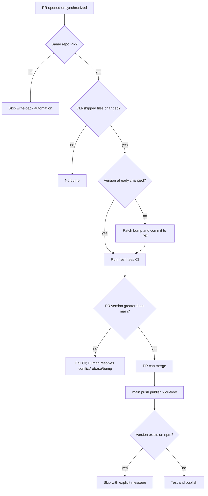

# Design

## Research

### Existing System

- The package is named `zest-dev`, currently version `1.0.0`, and exposes `zest-dev` through `bin.zest-dev = ./bin/zest-dev.js`. Source: `package.json:1-21`
- The package `files` allowlist includes `bin/`, `commands/`, `skills/`, `agents/`, `lib/`, `scripts/`, `plugin/`, `index.js`, `README.md`, and `LICENSE`; these are the package-shipped paths that should count as CLI release-affecting changes. Source: `package.json:22-33`
- The CLI reports `packageJson.version`, so package version bumps drive `zest-dev --version`. Source: `bin/zest-dev.js:127-130`
- Existing npm scripts provide `pnpm test:local` and `pnpm test:package`. Source: `package.json:34-38`
- Package E2E testing packs the repo, installs the tarball into an isolated npm project, and runs `npx zest-dev --version`. Source: `e2e/helpers/package_env.py:29-50`
- Required setup failures and subprocess failures should fail visibly, not be reported as success after partial failure. Source: `e2e/README.md:41-43`, `AGENTS.md:12-41`
- The repository currently has no GitHub workflow files. Source: file search `.github/workflows/*`, 2026-07-04

### Design Inputs

- `pnpm version patch` bumps the package version using the patch bump type. Source: pnpm CLI docs, `pnpm version`, 2026-07-04
- `pnpm version` normally creates a git commit and tag in a git repo, and `--no-git-tag-version` prevents that commit/tag behavior. Source: pnpm CLI docs, `pnpm version`, 2026-07-04
- GitHub Actions `pull_request` workflows can filter by activity type, branch, and paths; if branch and path filters are both set, both filters must match. Source: GitHub Actions workflow syntax docs, `pull_request`, 2026-07-04
- GitHub Actions permissions can be set at workflow or job level, with `read`, `write`, or `none` values; unspecified permissions become `none`. Source: GitHub Actions workflow syntax docs, `permissions`, 2026-07-04
- `pull_request_target` can grant read/write token permissions even from public forks, which is unnecessary here because fork PR automation is out of scope. Source: GitHub Actions workflow syntax docs, `pull_request_target`, 2026-07-04

### Constraints & Dependencies

- Fork PR automation is out of scope per user decision; workflows should explicitly skip fork PR write-backs.
- Concurrent PRs may bump to the same patch version; this spec catches stale version changes in CI but intentionally does not auto-merge `main` into open PRs.
- npm publish needs repository-side npm authentication or trusted publishing configured by a Human.
- Publishing should skip an already-published version explicitly rather than claiming success for a failed duplicate publish.

### Key References

- `package.json:1-47` - package name, version, bin mapping, package files, scripts.
- `bin/zest-dev.js:127-130` - CLI version reads from package metadata.
- `e2e/helpers/package_env.py:29-50` - packaged CLI validation path.
- `e2e/README.md:41-43` and `AGENTS.md:12-41` - fail-fast validation expectations.
- GitHub Actions workflow syntax docs - `pull_request`, `permissions`, `pull_request_target` behavior.
- pnpm CLI docs - `pnpm version patch --no-git-tag-version` behavior.

## Design Detail

### Design Decisions

- Decision: Treat `package.json` version as the single release version source because the CLI reports `packageJson.version`. Source: `package.json:1-3`, `bin/zest-dev.js:127-130`
- Decision: Detect CLI-affecting PRs from the existing package `files` allowlist, excluding version-result files as trigger-only inputs unless implementation needs package metadata changes to count. Source: `package.json:22-33`
- Decision: Use `pnpm version patch --no-git-tag-version` for PR bump commits so the workflow can edit version files without creating release tags during PR validation. Source: pnpm CLI docs, `pnpm version`, 2026-07-04
- Decision: Add a separate PR CI freshness check that compares PR head version to `main` when a version change exists, failing when head is not greater than main. Source: user requirement; fail-fast policy from `AGENTS.md:12-41`
- Decision: Skip fork PR write-backs rather than using `pull_request_target`, because fork automation is out of scope and `pull_request_target` has broader write-token implications. Source: user requirement; GitHub Actions workflow syntax docs, `pull_request_target`, 2026-07-04
- Decision: Publish on `main` only when the merged package version is absent from npm; duplicate published versions should be explicit skips or failures, not hidden success. Source: npm package version uniqueness from prior publish spec `specs/change/20260630-publish-to-npm/design.md:21-24`; fail-fast policy from `AGENTS.md:12-41`

### System Procedure

### Change Scope

Impact Areas:
- GitHub Actions PR automation and PR CI checks.
- GitHub Actions main-branch npm publish automation.
- Small CI helper scripts for semver comparison, changed-file detection, or npm-version existence checks if YAML-only logic becomes too brittle.
- Maintainer documentation for required npm credentials/trusted publishing and validation workflow.

Planned File Changes:
- `.github/workflows/` - add PR bump/freshness and main publish workflows.
- `scripts/ci/` or similar - add helper scripts for version comparison and publish checks if useful.
- `package.json` - optionally add script aliases for local CI helper validation.
- `README.md` or release docs - update only if implementation changes maintainer release instructions.

### Edge Cases

- Two PRs can both bump to the same next patch version; the later PR should fail freshness CI after `main` advances until it rebases or bumps again.
- A PR may include a manual version bump; automation should not double-bump it, but freshness CI should still validate it against `main`.
- If the bump workflow pushes a commit, it can retrigger PR workflows; skip logic must prevent repeated bumps once version has changed.
- `pnpm-lock.yaml` may or may not change from a version-only bump; the commit step should only commit actual changes.
- npm registry/network/auth failures on publish are required failures unless the version already exists and the workflow explicitly reports a skip.

### Verification Strategy

- Add local fixtures or script-level tests for version comparison: behind, equal, and ahead of `main`.
- Run `pnpm test:local` after workflow/script changes.
- Open a real same-repository PR that changes a CLI-shipped file and verify GitHub Actions creates the bump commit and the freshness CI passes.
- Validate the stale case by forcing or simulating a PR version equal to `main`; CI should fail.
- After merge, verify the main publish workflow either publishes the new version or explicitly skips because npm already has it.
